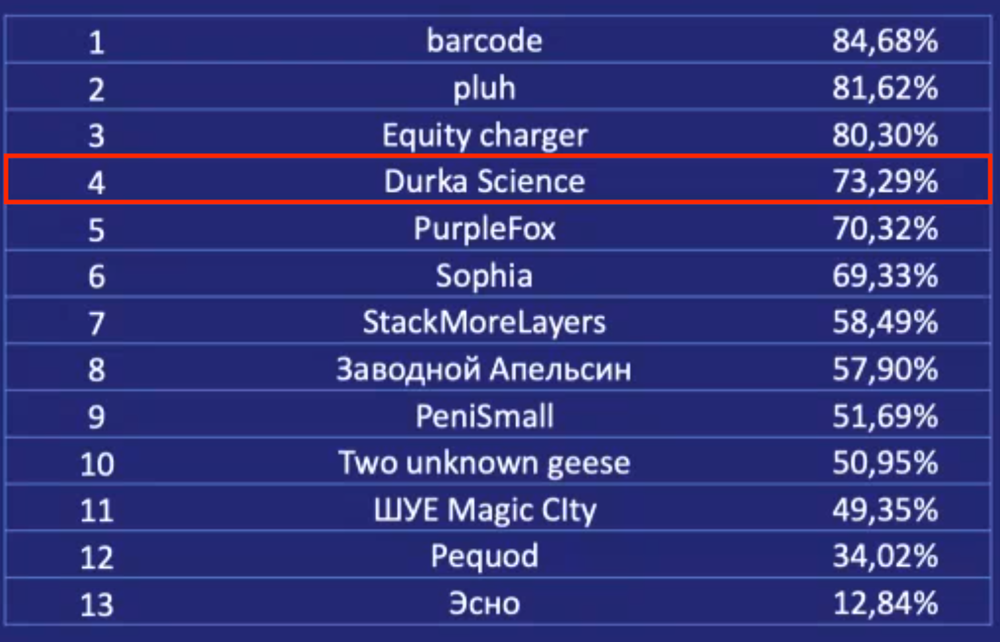

# [BIGTARGET Hackathon](https://bigtarget.online) 4rd place solution

Uplift modelling task on aggregated data. 
- Target transformation
- Feature selection
- Cross validation
- Boosting

## [Presentation](DurkaSciencePresentation.pdf)

# Competition results

